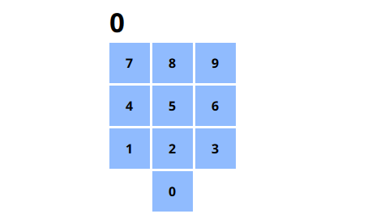

# QT QML assignment

This project is created upon the QML course on Udemy: https://www.udemy.com/course/qml-for-beginners/

Basically the idea of that assignment is to create some numpad widget using the QML API from the Qt framework
instead of the QWidget interface.

The following screenshot shows the numpad and what he can do:

Again, this application has been done with only QML, no C++ has been written to make it works other than the Qt framework. A simple application like this one using QML modeling
Language is using a lot of functionnality that is present on the QML.
1. Row: Each row contain 3 rectangle, and each rectangle contain a digit (0 through 9) and each of them contain a normal color, a hover one and a color during the press event that is an event that Qt is handling itself on the Rectangle QML object
2. spacing: The Spacing between each button inside the numpad is handled thanks to the spacing property of a Row (or even Column), and each of the element (either inside a row or inside of a column) will have its spacing between each other one
3. In order to make the 0 at the center of the number pad, we have used the Item element, that is an element that contains no real layout meaning that this object isn't visible, we still set the width and height of it (as it is also an object) but the background remains empty as is there anything inside.
